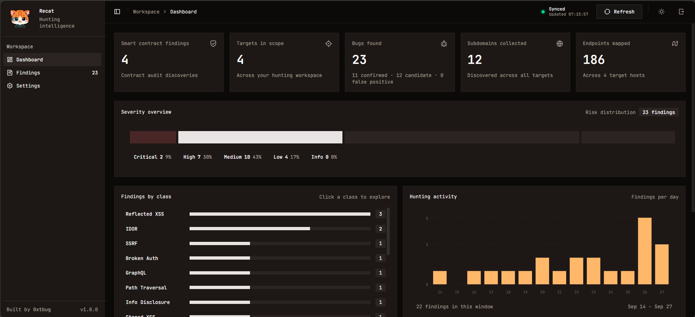

<p align="center">
  
</p>

<h1 align="center">Recat</h1>

<p align="center">A local workspace for security findings.</p>



Review findings from Hermes or other agents, inspect evidence, and export reports. Recat supports **Web**, **Smart contract**, and **Other** assets, including mobile, desktop, networks, and hardware.


## Features

- Dashboard with severity, status, activity, and asset coverage.
- Search and filters by project, category, vulnerability class, and status.
- Evidence viewer, JSON exports, and project ZIP downloads.
- Password access, censored view, and a reporting skill for Codex, Claude Code, and Hermes.

## Installation

### With an AI agent

Copy and paste this into Codex, Claude Code, or Hermes:

```text
Install and run Recat from https://github.com/0xtbug/Recat.
Reuse an existing Recat checkout, or clone the repository into an unused folder.
Read the root SKILL.md and follow its automatic setup workflow.
Install missing prerequisites and dependencies, generate a local password if
none is configured, and prepare the findings folder. Preserve existing data
and settings. Run tests, build, start the local server, and verify it responds.
Give me the URL, install directory, password file path, and restart instructions.
```

The [web setup skill](SKILL.md) also works when its full contents are pasted directly into an agent with terminal access.

### Manual

Requires Bun. Run commands from the directory containing `package.json` (`frontend/` in this workspace).

Create `.env` from `.env.example` and set `RECAT_PASSWORD`. Keep an existing configuration. The password is server-only; do not use a `VITE_` prefix.

```sh
bun install
bun run dev
```

Open the local URL printed by Vite, normally `http://127.0.0.1:5173`.

For production:

```sh
bun run build
bun run start
```

The production server binds to `127.0.0.1:5173`; `PORT` overrides the port. Recat requires a running server with access to the findings folder.

## Findings

Choose the source folder in **Settings**. The default is `../finding/source`, relative to the web repository. Recat reads project folders every five seconds.

```text
finding/source/
  project-name/bug/finding-name/
    finding.json
    README.md
    poc/
```

| Field        | Values                                      |
| ------------ | ------------------------------------------- |
| `asset_type` | `web`, `smart_contract`, `other`            |
| `status`     | `candidate`, `confirmed`, `false_positive`  |
| `severity`   | `critical`, `high`, `medium`, `low`, `info` |

Recat displays reported results and preserves the original records. See the [findings reference](docs/findings.md) for JSON examples, evidence paths, and import rules.

## Agent setup

1. Set the source folder in Recat **Settings**.
2. Open **Agent integration → Download SKILL.md**, or use [skills/SKILL.md](skills/SKILL.md) and set its **Active source folder** to the same absolute path.
3. Install that single file at one of these locations:

| Agent       | Project                                  | Personal                                   |
| ----------- | ---------------------------------------- | ------------------------------------------ |
| Codex       | `.agents/skills/recat-findings/SKILL.md` | `~/.agents/skills/recat-findings/SKILL.md` |
| Claude Code | `.claude/skills/recat-findings/SKILL.md` | `~/.claude/skills/recat-findings/SKILL.md` |
| Hermes      | Configured skills directory              | `~/.hermes/skills/recat-findings/SKILL.md` |

Project paths belong to the agent workspace. Hermes uses its configured home. Installation details: [Codex](https://learn.chatgpt.com/docs/build-skills), [Claude Code](https://code.claude.com/docs/en/skills), [Hermes](https://hermes-agent.nousresearch.com/docs/guides/work-with-skills/).

4. Start a new session and invoke `$recat-findings` in Codex or `/recat-findings` in Claude Code or Hermes.

The agent writes to the source folder directly. It needs filesystem access, or shared storage when running on another machine. No Recat password is needed to publish files.

For example, install the downloaded file in Codex with PowerShell (adjust the download path if needed):

```powershell
New-Item -ItemType Directory -Force "$HOME/.agents/skills/recat-findings"
Copy-Item "$HOME/Downloads/SKILL.md" "$HOME/.agents/skills/recat-findings/SKILL.md"
```

Use the Claude Code or Hermes destination above for those agents. Keep any existing customized skill before replacing it. Then ask the agent: “Use recat-findings to save this finding to Recat's configured source folder.”

## Development

| File                                            | Purpose                                       |
| ----------------------------------------------- | --------------------------------------------- |
| [SKILL.md](SKILL.md)                            | Website installation and development workflow |
| [AGENT.md](AGENT.md)                            | Code index and shared developer instructions  |
| [AGENTS.md](AGENTS.md) / [CLAUDE.md](CLAUDE.md) | Entry points for coding agents                |
| [skills/SKILL.md](skills/SKILL.md)              | Single-file findings integration              |

```sh
bun test
bun run lint
bun run build
```

The server password is stored in `RECAT_PASSWORD`; source settings are saved in `../.recat/settings.json`.

## License

[MIT](LICENSE) © 2026 [0xtbug](https://github.com/0xtbug).
